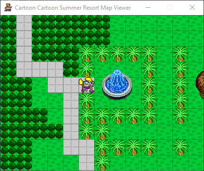

# Cartoon Cartoon Summer Resort Map Viewer

This is a work-in-progress map viewer for the Cartoon Cartoon Summer Resort series. The games were made with Adobe Shockwave and published on Cartoon Network's website in the summer of 2000. It currently supports all the maps from Episode 1, but some sprites are not positioned correctly.

## Instructions
To run the script, you will need Python 3.8 or higher (available [here](https://www.python.org/downloads/)) and pygame (install with <code>pip install pygame</code>).

Run the script <code>viewer.py</code> to start the viewer. Use the **arrow keys** to move between maps, and press **G** to show/hide the tile grid.

You can also pass the name of a file as an argument to open that specific map, but you will not be able to scroll with the arrow keys.

## Credits
Thanks to tomysshadow for their Movie-Restorer-Xtra which allowed me to decompress the map data from the game file, and to nosamu for the CastRipper tool which I used to export the tile graphics.

## Further Reading
* [Matt Bruv – Fixing A Bug In An 18 Year Old Shockwave Game](https://mattbruv.github.io/ccsr-bugfix/)
* [Unused game content on The Cutting Room Floor](https://tcrf.net/Cartoon_Cartoon_Summer_Resort)