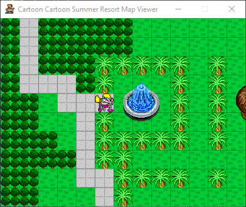

# Cartoon Cartoon Summer Resort Map Viewer

This is a map viewer for the Cartoon Cartoon Summer Resort games. The series was developed by Funny Garbage and published on Cartoon Network's website in the summer of 2000.

## Instructions
To run the script, you will need Python 3.8 or higher (available [here](https://www.python.org/downloads/)) and pygame (install with <code>pip install pygame</code>).

First, clone the repo using <code>git clone https://github.com/TheOnlyZac/ccsr-map-viewer</code>. Then init submodules with <code>git submodule init</code>, which will load the game resources.

### Controls
Start the map viewer by running the script <code>viewer.py</code>
* Use the **arrow keys** to move between maps.
* Use **1**, **2**, **3**, and **4** to change episode.
* Press **G** to show/hide the tile grid.
* Press **T** to show/hide tiles.
* Press **S** to show/hide sprites.
* Press **V** to show/hide invisible objects.
* Press **C** to take a snapshot of the current map.

You can also pass the name of a file as an argument to open that specific map, but you will not be able to scroll with the arrow keys.

## Credits
Thanks to tomysshadow for their Movie-Restorer-Xtra which allowed me to decompress the map data from the game file, and to nosamu for the CastRipper tool which I used to export the tile graphics.

## Further Reading
* [Matt Bruv – Fixing A Bug In An 18 Year Old Shockwave Game](https://mattbruv.github.io/ccsr-bugfix/)
* [Unused game content on The Cutting Room Floor](https://tcrf.net/Cartoon_Cartoon_Summer_Resort)